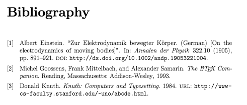

```{r}
getwd()
```

This artical is to illustrate how to use **LaTeX** to write a thesis.

# Basic structure

## Preamble

```
\documentclass[12pt]{report}
\usepackage[utf8]{inputenc}
\usepackage{graphicx}
\graphicspath{ {images/} }
```

`\documentclass` is used to define the class of our file. 

The first thing we need to choose is a document class. The *article* class isn't designed for writing long documents (such as a thesis) so we'll choose the *report* class, but we could also choose the *book* class.

We can also specify the font size by adding `[12pt]` behind.

Since we need to insert pictures, `\usepackage{graphicx}` will load *graphicx* package. And `\graphicspath{ {images/} }` will tell our file where to find our pics.

One simple way to write the title page is:

```
\title{
{Thesis Title}\\
{\large Institution Name}\\
{\includegraphics{university.jpg}}
}
\author{Author Name}
\date{Day Month Year}
```

## frontmatter

```
\chapter*{Abstract}
Abstract goes here
 
\chapter*{Dedication}
To mum and dad
 
\chapter*{Declaration}
I declare that..
 
\chapter*{Acknowledgements}
I want to thank...
 
\tableofcontents
```

After the title page we need to add in an abstract, dedication, declaration and acknowledgements section. We can add each of these in on separate pages using **unnumbered** chapters. To do this we use the *\chapter* command and add an asterisk, ie `\chapter*`. After these sections we'll add a table of contents using the *\tableofcontents* command.

## The main body

Now for the main body of the document. In this example we will add-in five chapters, one of which will be an introduction and another will be a conclusion. However, instead of just composing these chapters in the *main .tex* file, we'll create *a separate .tex* file for each chapter in the chapters folder. We can then fill in these chapters with text remembering to split them up into *sections* and *subsections*.

Then to add these chapters into the document, we use the *\input* command in the root document. Remember to add in *chapters/* before the file name so that LATEX knows where to find it.

```
\chapter{Introduction}
\input{chapters/introduction}
 
\chapter{Chapter Two Title}
\input{chapters/chapter02}
 
\chapter{Chapter Three Title}
\input{chapters/chapter03}
 
\chapter{Chapter Four Title}
\input{chapters/chapter04}
 
\chapter{Conclusion}
\input{chapters/conclusion}
```

## The endmatter

```
\appendix
\chapter{Appendix Title}
\input{chapters/appendix}
```

*\appendix* command to tell LATEX that what follows are appendices. 


# Page layout

We will start customising the page layout using the *geometry* and *fancyhdr* packages. 

`\documentclass[12pt,twoside]{report}` will make our paper two-sides.

## geometry Package

`\usepackage[a4paper,width=150mm,top=25mm,bottom=25mm]{geometry}` will load up the package for us and do some adjustment at the same time.

By default, the paper size is US letter so we may need to change it to *a4paper* and `width` is the width of our text, `top` and `bottom` set up the margin sizes.

You will notice that on even pages the text is positioned slightly closer to the right-hand side and on odd pages it's closer to the left. Or in other words, the inner margin is smaller than the outer. This is due to the `twoside` argument. To avoid it, we can use `bindingoffset` in *geometry* package, like:

```
\usepackage[a4paper,width=150mm,top=25mm,bottom=25mm,bindingoffset=6mm]{geometry}
```


## The fancyhdr package

`fancyhdr` is used to add headers and footers to our paper.

```
\usepackage{fancyhdr}
\pagestyle{fancy}
```

If we now compile the code you will see that a header has been added to all the pages except the title page, the contents page and the first page of each new chapter. By default, the headers all contain the chapter and section titles.

We can also customise it but I think the default setting should work well.

Finally, `\pagestyle{empty}` will remove all headers and footers.

If we want a page with no headers or footers *except for a simple page number* at the bottom we would use the keyword `plain`.

*Note: * using this command changes the page style for all the pages following the command. Therefore we need to turn the page style back to fancy as soon as we want the headers back.


# Figures, subfigures and tables

## images

We already add `graphicx` package to our environment and also set up the path to read pictures by `\graphicspath`. The following is an example to add a picture to our thesis:

```
\begin{figure}[h]
\centering
\includegraphics[scale=0.5]{graph_a}
\caption{An example graph}
\label{fig:x cubed graph}
\end{figure}
```

`h` is our position specifier; `scale=0.5` means we halved the size of image; `\caption` is the title for our image; `\label` will help us with the following text if we need to refer back to it. And note that LaTeX has automatically numbered it according to what chapter it's part of. As for `refer`, we can add `\ref{fig:x cubed graph}` to our text then latex will give us the figure number in the place of this command in the pdf.

## subfigures

If we need to do some complicated figures with multiple images, we can use `subfigure` environment inside of a `figure` environment. But we need to load `caption` and `subcaption` package at first.

```
\usepackage{caption}
\usepackage{subcaption}

\begin{figure}
     \centering
     \begin{subfigure}[b]{0.3\textwidth}
         \centering
         \includegraphics[width=\textwidth]{graph1}
         \caption{$y=x$}
         \label{fig:y equals x}
     \end{subfigure}
     \hfill
     \begin{subfigure}[b]{0.3\textwidth}
         \centering
         \includegraphics[width=\textwidth]{graph2}
         \caption{$y=3sinx$}
         \label{fig:three sin x}
     \end{subfigure}
     \hfill
     \begin{subfigure}[b]{0.3\textwidth}
         \centering
         \includegraphics[width=\textwidth]{graph3}
         \caption{$y=5/x$}
         \label{fig:five over x}
     \end{subfigure}
        \caption{Three simple graphs}
        \label{fig:three graphs}
\end{figure}
```
```
Parameter	Position
h	Place the float here, i.e., approximately at the same point it occurs in the source text (however, not exactly at the spot)
t	Position at the top of the page.
b	Position at the bottom of the page.
p	Put on a special page for floats only.
!	Override internal parameters LaTeX uses for determining "good" float positions.
H	Places the float at precisely the location in the LATEX code. Requires the float package. This is somewhat equivalent to h!.
```

`0.3\textwidth` is to define the width of the image, `\textwidth` here is the width of our text. Note the `\textwidth` below in `\includegraphics` is the width of our image. To add some spacing between the figures we'll use the `\hfill` command. The beauty of these subfigures is that we can refer to each of them individually in the text due to their individual labels—but we can also give the whole figure a caption and label.

Now if we add a `\listoffigures` command just after the table of contents `\tableofcontents`, LaTeX will generate a list of all the figure used in the thesis and inform us where each can be found.

## tables

When writing a thesis you should enclose all your tables in the `table` environment. Here's a basic example:

```
\begin{table}[h]
\centering
\begin{tabular}{l | l | l}
A & B & C \\
\hline
1 & 2 & 3 \\
4 & 5 & 6
\end{tabular}
\caption{very basic table}
\label{tab:abc}
\end{table}
```

## subtables

Similar with subfigures:

```
\begin{table}[h]
    \begin{subtable}[h]{0.45\textwidth}
        \centering
        \begin{tabular}{l | l | l}
        Day & Max Temp & Min Temp \\
        \hline \hline
        Mon & 20 & 13\\
        Tue & 22 & 14\\
        Wed & 23 & 12\\
        Thurs & 25 & 13\\
        Fri & 18 & 7\\
        Sat & 15 & 13\\
        Sun & 20 & 13
       \end{tabular}
       \caption{First Week}
       \label{tab:week1}
    \end{subtable}
    \hfill
    \begin{subtable}[h]{0.45\textwidth}
        \centering
        \begin{tabular}{l | l | l}
        Day & Max Temp & Min Temp \\
        \hline \hline
        Mon & 17 & 11\\
        Tue & 16 & 10\\
        Wed & 14 & 8\\
        Thurs & 12 & 5\\
        Fri & 15 & 7\\
        Sat & 16 & 12\\
        Sun & 15 & 9
        \end{tabular}
        \caption{Second Week}
        \label{tab:week2}
     \end{subtable}
     \caption{Max and min temps recorded in the first two weeks of July}
     \label{tab:temps}
\end{table}
```

Now in the same way we added a list of figures after the table of contents we can add a list of tables using the `\listoftables` command.

# Bibliographies with BibLaTeX

In this post we are going to look at adding a bibliography to our thesis. To do this we are going to use the `biblatex` package. This involves creating a list of sources in a separate file called a `.bib` file.

## Bib file 

Create a `.bib` file instead of a `.txt` file and give it a name.

Now every time we need to reference a source we can cite it in the text and then fill in the source details in the `.bib` file. First we'll look at filling in our `.bib` file and then we'll move on to discussing citations. To add a new entry to our `.bib` file we need to first tell `BibLaTeX` what type of source we are referencing. We do this using an `@` symbol followed immediately by the source type.


```
@article{<citation key>,
    author        = {},
    title         = {},
    journaltitle  = {},
    year          = {}
}
 
@online{<citation key>,
    author        = {},
    title         = {},
    year          = {},
    url           = {}
}
 
@book{<citation key>,
    author        = {},
    title         = {},
    year          = {}
}
```
`<citation key>` behaves like the `label` of images and tables.

But sometimes we may need to use more details, here are some examples:

```
@article{einstein,
    author        = {Albert Einstein},
    title         = {Zur Elektrodynamik bewegter K{\"o}rper. (German) [On the electrodynamics of moving bodies]},
    journaltitle  = {Annalen der Physik},
    year          = {1905},
    volume        = {322},
    number        = {10},
    pages         = {891-921},
    doi           = {http://dx.doi.org/10.1002/andp.19053221004}
}
 
@online{knuthwebsite,
    author        = {Donald Knuth},
    title         = {Knuth: Computers and Typesetting},
    year          = {1984},
    url           = {http://www-cs-faculty.stanford.edu/~uno/abcde.html}
}
 
@book{latexcompanion,
    author        = {Michel Goossens and Frank Mittelbach and Alexander Samarin},
    title         = {The \LaTeX\ Companion},
    year          = {1993},
    publisher     = {Addison-Wesley},
    location      = {Reading, Massachusetts}
}
```

All of the information about the recognised source types and all the keywords you can use can be found in the [biblatex documentation](http://mirror.its.dal.ca/ctan/macros/latex/contrib/biblatex/doc/biblatex.pdf).

Back to our main `.txt` file. Load up the `biblatex` package and then tell `\addbibresource` our `.bib` file name with `.bib` extension.

```
\usepackage{biblatex}
\addbibresource{references.bib}
```

## Citations

To cite a source in the text we use one of the `biblatex` citation commands. The simplest is the `\cite` command which prints the citation without any brackets unless you are using the numeric or alphabetic styles.

```
\cite{latexcompanion}
```

Another one is the `\parencite` command which prints citations in parentheses except when using the numeric or alphabetic styles when it uses square brackets.

The citation commands in biblatex also give us the option of adding a `prenote` and `postnote` in as arguments:

* a `prenote` is a word or phrase like *see* that is inserted at the start of the citation;

* a `postnote` is text you want inserted at the end of the citation.


To add these notes in you uses two sets of square brackets in the citation command. If you *only* open one set of square brackets it will assume the contents of the brackets is a `postnote`, so if you only want a prenote make sure you still open the second set of square brackets and then just leave them empty. Here are some examples:

```
TEXT\parencite[see][p10]{latexcompanion}
TEXT\parencite[compare][]{knuthwebsite}
TEXT\parencite[e.g.][page 300]{einstein}
```


See details in the [biblatex documentation](http://mirror.its.dal.ca/ctan/macros/latex/contrib/biblatex/doc/biblatex.pdf).

## Styles

Now to actually get the bibliography printed in our thesis we use the `\printbibliography` command at the end of the document. By default the bibliography and citations use the numeric style which looks like this: 

<center>  </center>

I think this one should be enough. There are some other styles, like `alphabetic` and  `authoryear`. Specity the style in `biblatex` package as following: `\usepackage[style=alphabetic]{biblatex}`

See [details](https://www.overleaf.com/learn/latex/How_to_Write_a_Thesis_in_LaTeX_(Part_4):_Bibliographies_with_BibLaTe)


# Customising Your Title Page and Abstract

We're going to look at customising some of the opening pages. We made a rather makeshift title page using the `\maketitle` command and by using an `\includegraphics` command in the `\title` command. Although this works, it doesn't give us as much flexibility as we may want.

## The title page

```
\begin{titlepage}
   \begin{center}
       \vspace*{1cm}
 
       \textbf{Thesis Title}
 
       \vspace{0.5cm}
        Thesis Subtitle
 
       \vspace{1.5cm}
 
       \textbf{Author Name}
 
       \vfill
 
       A thesis presented for the degree of\\
       Doctor of Philosophy
 
       \vspace{0.8cm}
 
       \includegraphics[width=0.4\textwidth]{university}
 
       Department Name\\
       University Name\\
       Country\\
       Date
 
   \end{center}
\end{titlepage}
```

A much better way to do this is to use the `titlepage` environment. We will do this in a seperate `.txt` file and input it. The first thing we'll do is enclose everything in the `title page` within the `center` environment so it's all aligned to the centre. Next we need to instruct LATEX to leave a gap between the top of the page and the first line of text. To do this we use the `\vspace` command followed by a length. We also need to add an asterisk(*) into the command to make sure LATEX doesn't decide to ignore the command. Next we'll add the thesis title in bold font using the `\textbf` command. To leave a gap between this and the next line of text we use the `\vspace` command again, this time without the asterisk. Next we'll add in a subtitle followed by some more vertical space and then the author name in bold font. This concludes what we want at the top of the title page—the rest of the content we'll add at the bottom of the title page.

To separate these two sections out we'll use the `\vfill` command which will automatically add in the amount of vertical space needed for the content to fill the page. Next we'll add in a line of text to specify what degree the thesis is being submitted for. The `double backslash \\`  is used to create a new line. We'll then add more space before adding in the university logo specifying it's width as a fraction of the text width. Finally we'll add in some information about the university and the date.

Now in the `main .tex` file we can replace the `\maketitle` command with an `input` command linked to our new title page.

To change the size of the font in the title page, we have 10 choices:

```
\tiny 
\scriptsize
\footnotesize
\small
\normalsize
\large
\Large
\LARGE
\huge
\Huge
```

The modified version is:

```
\begin{titlepage}
    \begin{center}
        \vspace*{1cm}
 
        \Huge
        \textbf{Thesis Title}
 
        \vspace{0.5cm}
        \LARGE
        Thesis Subtitle
 
        \vspace{1.5cm}
 
        \textbf{Author Name}
 
        \vfill
 
        A thesis presented for the degree of\\
        Doctor of Philosophy
 
        \vspace{0.8cm}
 
        \includegraphics[width=0.4\textwidth]{university}
 
        \Large
        Department Name\\
        University Name\\
        Country\\
        Date
 
    \end{center}
\end{titlepage}
```

Note: when apply some font size, then all the words behind it will change until new command of font size appears. 

## The abstract

Like the title page, we can also write a seperate `abstract .txt` file and customize it and then input it to `main .txt` file. 

At the top of this file we need to change the page style to `plain` in order to *stop the headers* being added in. Now in a similar way to the title page we'll add in some custom titles and then the abstract text.

```
\thispagestyle{plain}
\begin{center}
    \Large
    \textbf{Thesis Title}
 
    \vspace{0.4cm}
    \large
    Thesis Subtitle
 
    \vspace{0.4cm}
    \textbf{Author Name}
 
    \vspace{0.9cm}
    \textbf{Abstract}
\end{center}
```
